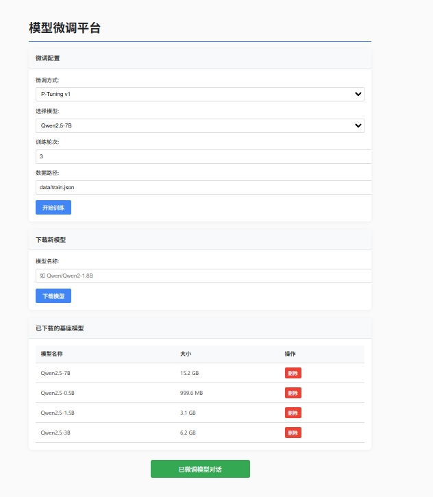

# 大型语言模型微调平台

这是一个用于简化大型语言模型（特别是QWEN系列）微调过程的Web平台。通过简单的界面操作，您可以下载模型、进行不同方法的微调训练、管理模型，以及与微调后的模型进行对话。



## 主要功能

- **模型下载**：直接从Hugging Face下载模型，支持Qwen系列模型
- **多种微调方法**：
  - **LoRA (Low-Rank Adaptation)**：参数高效的微调方法，只训练低秩矩阵
  - **P-Tuning v1**：通过连续提示嵌入进行微调
  - **P-Tuning v2**：P-Tuning的改进版，性能更强
- **直观的Web界面**：实时监控训练进度，管理模型，进行对话测试
- **资源优化**：支持4-bit量化，减少模型加载内存需求
- **模型管理**：方便地查看、删除已下载或微调的模型

## 安装

### 系统要求

- Python 3.8+
- CUDA支持的GPU (用于高效训练和推理)
- 至少16GB内存，推荐32GB+用于大型模型

### 安装步骤

1. 克隆此仓库：
   ```bash
   git clone https://github.com/lanjunfei/qwen-lora-ptuning
   cd qwen-lora-ptuning
   ```

2. 安装依赖：
   ```bash
   pip install -r requirements.txt
   ```
   
   如果您在安装`bitsandbytes`时遇到问题，可能需要根据您的CUDA版本安装特定版本：
   ```bash
   pip install bitsandbytes==0.41.1
   ```

## 使用方法

### 启动平台

```bash
python app.py
```

然后在浏览器中访问 `http://localhost:9110`。

### 下载基础模型

1. 在主页的"下载新模型"部分，输入模型名称（如`Qwen/Qwen2-1.8B`或`Qwen2.5-0.5B`）
2. 点击"下载模型"按钮
3. 等待下载完成（可在下载页面查看进度）

### 进行微调训练

1. 在主页的"微调配置"部分，选择：
   - 微调方式（LoRA、P-Tuning v1或P-Tuning v2）
   - 基础模型
   - 训练轮数
   - 数据路径（默认为`data/train.json`）
2. 点击"开始训练"按钮
3. 在日志页面监控训练进度

### 数据格式

训练数据应为JSON格式，例如：

```json
[
  {
    "instruction": "介绍一下中国的四大发明",
    "output": "中国的四大发明是指造纸术、印刷术、火药和指南针。这些发明对世界文明产生了深远影响..."
  },
  {
    "instruction": "写一首关于春天的诗",
    "output": "春风轻拂面，花香满园间。碧水映青山，鸟语伴蝉鸣..."
  }
]
```

### 与微调后的模型对话

1. 点击主页上的"已微调模型对话"按钮
2. 在对话页面，选择一个微调好的模型
3. 输入问题并点击"发送"
4. 等待模型生成回答

## 微调方法说明

### LoRA (Low-Rank Adaptation)

LoRA通过在原始权重矩阵旁边添加低秩矩阵来微调大型模型，只需训练这些低秩矩阵，大大减少了需要更新的参数数量和内存占用。

- **优点**：内存效率高，训练速度快，适配性好
- **适用场景**：资源有限但需要微调大型模型时

### P-Tuning v1

P-Tuning使用连续提示嵌入（Continuous Prompt Embeddings）来替代传统的离散提示词，并通过训练这些嵌入来提高模型在特定任务上的表现。

- **优点**：参数数量极少，训练速度快
- **适用场景**：简单的文本生成任务，资源严重受限情况

### P-Tuning v2

P-Tuning v2是对v1的增强版本，在每一层都添加了可训练的提示嵌入，性能显著提升。

- **优点**：效果比v1更好，仍然保持参数效率
- **适用场景**：需要更好效果但仍希望保持训练参数量小的场景

## 高级功能

### 量化推理

本平台支持4-bit量化推理，可以显著减少内存占用，使大型模型在资源有限的设备上运行。若要启用此功能，请确保已安装`bitsandbytes`库。

## 目录结构

```
deepseek_lora_ptuning_env/
├── app.py                  # Web应用主程序
├── inference.py            # 推理和对话实现
├── train.py                # 命令行训练入口脚本
├── scripts/
│   ├── train_lora.py       # LoRA微调实现
│   ├── train_ptuning_v1.py # P-Tuning v1实现
│   └── train_ptuning_v2.py # P-Tuning v2实现
├── data/
│   └── dataset.py          # 数据集处理
├── templates/              # Web页面模板
│   ├── index.html          # 主页
│   ├── inference.html      # 对话页面
│   ├── log.html            # 训练日志页面
│   └── preload.html        # 模型下载页面
├── output/                 # 输出目录
│   ├── models/             # 微调后的模型
│   └── logs/               # 训练日志
└── requirements.txt        # 依赖库列表
```

## 注意事项

- 对于较大的模型(>7B参数)，建议使用配备至少24GB显存的GPU
- 对话生成有120秒超时限制，如需更长时间可调整`inference.py`中的`timeout_seconds`参数
- 如遇到模型加载或推理错误，尝试安装最新版本的PEFT和Transformers库

## 许可证

此项目采用MIT许可证 - 详见LICENSE文件

## 致谢

- [Hugging Face Transformers](https://github.com/huggingface/transformers) - 提供模型和工具库
- [PEFT](https://github.com/huggingface/peft) - 参数高效微调方法
- [Qwen](https://github.com/QwenLM/Qwen) - 基础模型 